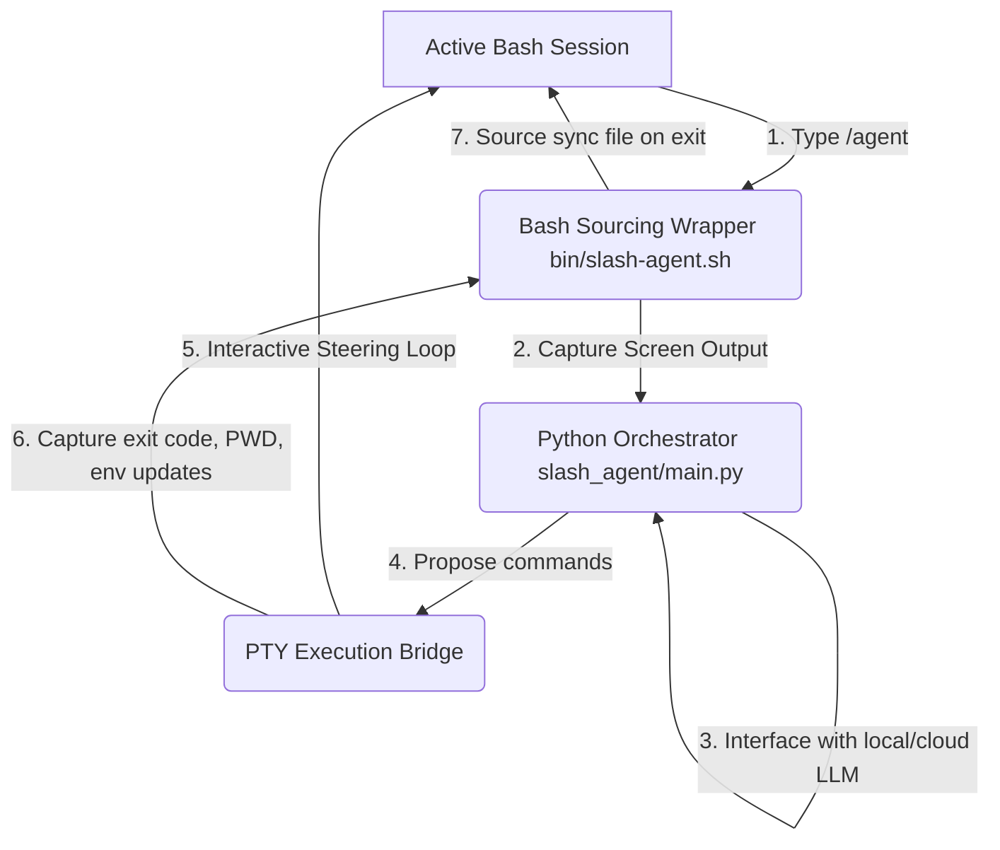

# ⚡ slash-agent: Native LLM Copilot for Your Terminal

[](https://opensource.org/licenses/MIT)
[](https://www.python.org/)
[](https://www.gnu.org/software/bash/)
[](http://makeapullrequest.com)


**slash-agent** is a zero-overhead, dormant AI coding partner integrated natively into your active Bash shell. Simply type `/agent` when you hit a blocker.

* 🖥️ **Terminal Context Capture:** Instantly reads recent `tmux` scrollback or shell history to diagnose errors without manual copy-pasting.
* 🔒 **Local & Private LLMs:** Operates 100% offline with local Ollama instances or cloud powerhouses (OpenAI/Azure OpenAI).
* 🔀 **Host Shell State Sync:** Automatically persists directory transitions (`cd`) and environment exports (`export`) back to your parent shell session on exit.

> [!TIP]
> 🤖 **Pairing with an AI Assistant?**  
> Want a 10-second overview? Copy-paste this seed prompt into Claude Code, Antigravity, Copilot, or ChatGPT:
> ```text
> Analyze https://github.com/akatzmann/slash-agent. 
> 1. What is this tool, what is a typical use-case, and do I need it?
> 2. How does it differ from similar tools?
> 3. Give me an open-ended assessment based on the actual codebase/structure (not just README marketing): Does it deliver on its claimed USP?
> Keep your answer concise so I can digest it in 10 seconds.
> ```

---

### 🔍 The 10-Second Reality Check

| 🟢 What it IS | 🔴 What it IS NOT |
| :--- | :--- |
| **⚡ A zero-latency terminal utility.** It remains completely dormant and consumes exactly 0MB of RAM until you type `/agent` or `agent`. | **🕵️‍♂️ A resident background daemon.** It does not track your keystrokes in real-time, run background analytics, or drain your battery. |
| **🪟 A screen-aware scraper.** It instantly pulls the last 50–100 lines of your active shell history or `tmux` scrollback to diagnose the error that just occurred. | **🏗️ A project architect.** It is not designed to map out massive 50-file repository architectures or handle monolithic code refactors. |
| **🛠️ An interactive shell executor.** It feeds commands into a real pseudo-terminal (PTY) and asks for live user validation before executing. | **📋 A basic copy-paster.** It doesn't just vomit Markdown code blocks that leave you manually highlighting, copying, and running text. |
| **🔀 A state-synchronizer.** It bridges the gap between subshells, allowing environment exports and directory changes (`cd`) to persist in your parent shell. | **🏞️ A sandboxed IDE.** It modifies your actual live environment; it is not an isolated, safe-play sandbox. |

### 🔒 Privacy & Security Model

For detailed specifications on the safety sandbox, permission gating, sensitive path restrictions, and transient logging, see the [Security Model Guide](docs/security_model.md).

Unlike web interfaces or proprietary commercial wrappers that silently pipe your telemetry to corporate servers, **slash-agent** puts you in total control of your data flow:

* **🔐 Bring Your Own Keys (BYOK):** It talks directly to LLM providers via standard API endpoints (OpenAI, Azure OpenAI, etc.). No middleman server intercepts your terminal logs or source code.
* **🏠 100% Air-Gapped / Offline Capable:** By pointing the backend API configuration to a local Ollama instance or an OpenAI-compatible local server (such as `llama.cpp`, `vLLM`, `SGLang`, or `Xinference`), your terminal history, source code, and error tracebacks never leave your physical machine. See [Configuring Local Providers](docs/documentation.md#5-local-openai-compatible-apis) for detailed instructions.

---

## ⚡ Quick Start (5-Second Install)

Get up and running instantly. Run the quick installer script in your shell:

**For Unix (Bash, Zsh, Ksh, Fish):**
```bash
curl -fsSL https://raw.githubusercontent.com/akatzmann/slash-agent/master/bin/installer.sh | bash
```

**For Windows (PowerShell 5.1 & PowerShell Core 7+):**
```powershell
powershell -ExecutionPolicy Bypass -Command "irm https://raw.githubusercontent.com/akatzmann/slash-agent/master/bin/installer.ps1 | iex"
```

*(This automatically clones the repo to `~/.slash-agent`, configures a Python virtual environment, installs requirements, and registers the shell integration in your appropriate shell profile file, e.g. `~/.zshrc`, `~/.bashrc`, `config.fish`, or `$PROFILE`.)*

---


## 🌟 Key Features

* **🤖 LLM Agnostic & Privacy First:** Supports local offline models (like Ollama) with zero keys required and zero data leaving your machine, as well as OpenAI and Azure OpenAI.

* **🔌 Zero-Overhead Integration:** Completely passive. Consumes zero CPU/memory until you run `/agent`—no running background daemons, cron jobs, or log listeners.
* **🔍 Context-Aware Diagnoses:** Instantly extracts the last 50 lines of your active `tmux` pane or terminal history, letting the LLM read error outputs and tracebacks without manual copy-pasting.
* **⚡ State Synchronization:** Working directory transitions (`cd`) and environment exports (`export KEY=VAL`) made by the agent automatically sync back to your parent shell session on exit.
* **🌉 Interactive PTY Bridge:** Executes proposed commands in a pseudo-terminal (PTY), allowing you to interactively type passwords (e.g. `sudo`), view colored output, and see progress bars.
* **🕹️ Steerable Confirmation Loop:** Full control over every action:
  * **`y` (yes):** Run the command.
  * **`n` (no):** Refuse the command and inform the agent.
  * **`e` (edit):** Inline edit the command before running it.
  * **`c` (comment):** Type natural language guidance back to the agent (e.g. *"Use yarn instead of npm"*).
* **🛡️ Dry-run & Auto-confirm Modes:** Preview agent actions safely with `-n` / `--dry-run`, or run fully unattended with `-y` / `--yes`.
* **🧩 Agent Skills:** Drop a `SKILL.md` into `.agent/skills/`, `.claude/skills/`, `.github/skills/`, or global paths like `~/.gemini/config/skills/` and the agent automatically discovers and uses it. Compatible with Claude, Copilot, Gemini, and other standard skill formats. See [`docs/skills-guide.md`](docs/skills-guide.md) for details.

---

## 🎬 See it in Action

```
$ npm run build
❌ ERROR: Build failed. Cannot find module 'dotenv' in server.js:12

$ /agent Fix this
[Agent Shell] Initializing with model 'gemma4:e4b-it-qat' at 'http://127.0.0.1:11434'...
[Agent Started Task]
Analyzing terminal context... Identified missing dependency 'dotenv' in server.js.

[Agent] Proposed Command:
  $ npm install dotenv && npm run build

Confirm action: [y]es / [n]o / [e]dit / [c]omment ? y
[Agent Running]: npm install dotenv && npm run build
...
added 1 package, and audited 120 packages in 1s
✓ Build completed successfully!

I have installed the missing 'dotenv' package and verified that the build now passes.
```

---

## 🎯 Common Use Cases

* 🛠️ **Build & Test Crashes:** When a compiler error, script traceback, or unit test fails, simply run `/agent` to let it read the error logs directly and propose a fix.
* 📦 **Dependency Resolution:** Missing package imports? The agent reads the import error, installs the package, and verifies the build.
* 💻 **Quick Scripting & Automation:** Ask the agent to generate helper scripts, configure development environments, or perform regex logs processing on the fly.
* ⚙️ **System Configuration:** Easily set up local databases, systemd services, or configuration files without looking up command flags.

---

## 📊 Feature Comparison Matrix

| Capability | 🌐 Standard Web UI <br> (ChatGPT / Claude) | 💻 Shell Copilots <br> (Copilot CLI / Gh-Cli) | 🧰 Project Agents <br> (Aider / Claude Code) | ⚡ slash-agent |
| :--- | :--- | :--- | :--- | :--- |
| **🧠 How it Gets Context** | ⌨️ Manual copy-paste | 📝 You type a prompt | 📂 Reads entire git repo | 🖥️ Scrapes active terminal scrollback |
| **🚀 Idle System Overhead** | 🚫 None (Browser) | 🚫 None (On-Demand) | ⚠️ High (Heavy runtimes) | ⚡ Zero (Dormant shell function) |
| **🛠️ Command Execution** | ❌ None (Read-only) | 🔄 Prints text to run | 🤖 Autonomous file edits | 🤝 Interactive PTY Loop (Run/Edit/Steer) |
| **🔗 Parent Shell Sync** | ❌ No | ❌ No | ❌ No | ✅ Yes (`cd` & `export` persist) |
| **🔒 Local Privacy Support** | ❌ No (Cloud only) | ❌ No (Cloud only) | ✅ Yes (Configurable) | ✅ Yes (Full Ollama/Local support) |
| **🎯 Primary Superpower** | Abstract logic & algorithmic brainstorming | Quick syntax lookups <br> (e.g., *"how to untar file"*) | Large autonomous feature builds & massive refactors | Instant post-crash fixes & rapid terminal adjustments |

> [!TIP]
> **Developer Rule of Thumb:**
> * Use **Aider** or **Claude Code** when you are entering a deep-work coding session to build an entire feature.
> * Keep **slash-agent** mapped in your `.zshrc` / `.bashrc` / `.config/fish` as an instant emergency lever for when your test suite or deployment pipeline randomly blows up in your face.

---

## 🔍 How it Works

Unlike standard agents that run in isolated subshells (and cannot modify your current directory or environment), **slash-agent** uses a lightweight state synchronization protocol:



1. **Context Capture:** The shell wrapper automatically captures the active `tmux` pane buffer (or history) to give the LLM immediate context.
2. **Interactive PTY Bridge:** Commands run inside a real pseudo-terminal (PTY) so you see colored outputs, progress bars, and can interact with prompts (like typing passwords for `sudo`).
3. **Parent Shell Sync:** Directory changes (`cd`) or environment variables (`export`) are safely passed back to your main shell session via a temporary sourcing script on exit.

---

## 🔧 Manual Installation

If you prefer to set up the agent manually instead of using the Quick Start script:

1. **Clone the Repository:**
   ```bash
   git clone https://github.com/akatzmann/slash-agent.git ~/.slash-agent
   cd ~/.slash-agent
   ```
2. **Install Python Requirements:**
   ```bash
   pip install -r requirements.txt
   ```
3. **Register Shell Integration:**
   Add the appropriate sourcing statement to your shell configuration file:
   * **Bash (Linux):** `source ~/.slash-agent/bin/slash-agent.sh` in `~/.bashrc`
   * **Bash (macOS):** `source ~/.slash-agent/bin/slash-agent.sh` in `~/.bash_profile` (or `~/.profile`)
   * **Zsh:** `source ~/.slash-agent/bin/slash-agent.sh` in `~/.zshrc`
   * **Ksh:** `source ~/.slash-agent/bin/slash-agent.sh` in `~/.kshrc`
   * **Fish:** `source ~/.slash-agent/bin/slash-agent.fish` in `~/.config/fish/config.fish`
   * **PowerShell:** `. "$Home\.slash-agent\bin\slash-agent.ps1"` in your `$PROFILE`

---

## 💻 Windows Support (Native & WSL2)

**slash-agent** supports both **native Windows execution** under PowerShell (Windows PowerShell 5.1 and PowerShell Core 7+) and **WSL2 (Windows Subsystem for Linux)**.

* **Native Windows/PowerShell**: Install using the PowerShell one-liner. Command execution is handled via a thread-based, non-interactive shell runner. While interactive console UIs (like `vim` or `less`) are not supported natively due to Windows PTY limitations, standard development tools (such as `git`, `npm`, `python`, etc.) work natively.
* **WSL2**: Supported natively by running the Unix Quick Start installation command inside any WSL2 Linux terminal (like Ubuntu or Debian).

> [!NOTE]
> If you are running local LLM engines (like `llama.cpp` or `Ollama`) natively on your Windows host and need to connect to them from `slash-agent` inside WSL2, see the [WSL2 Host Network Integration guide](docs/documentation.md#wsl2-host-network-integration).

---

## ⚙️ Configuration

Configure the LLM backend, endpoint, model, and capture settings in your configuration file (located at `~/.config/slash-agent/env`) or shell profile. You can also override the configuration file path by exporting the `SLASH_AGENT_CONFIG_FILE` environment variable.

```bash
# LLM Backend: ollama (default), openai (also covers local llama.cpp/vLLM/etc.), azure_openai, dummy
export AGENT_BACKEND="ollama"

# Model name (Defaults: gemma4:latest for ollama, gpt-5.4-nano for openai, gemma4-27b for local APIs)
export AGENT_MODEL="gemma4:latest"

# API endpoint base URL (defaults: http://127.0.0.1:11434 for ollama, http://127.0.0.1:8080/v1 for llama.cpp)
export AGENT_ENDPOINT="http://127.0.0.1:11434"

# OpenAI API Key (required if AGENT_BACKEND="openai". Use "local-api-key" for local APIs)
export OPENAI_API_KEY=""

# Context extraction settings
export AGENT_TMUX_LINES=50          # Lines captured from active tmux scrollback
export AGENT_HISTORY_COMMANDS=20    # Commands captured from history fallback

# Thinking / reasoning mode settings
export AGENT_THINKING_LEVEL="off"   # Thinking level: off (default), low, medium, high (for reasoning models)

# Sampling parameter settings (optional)
# export AGENT_TEMPERATURE="0.2"   # LLM temperature: float (e.g. 0.2), blank/unset for default. (OpenAI's o-series reasoning models do not support custom temperature)
# export AGENT_TOP_P="0.9"          # LLM top_p (nucleus sampling): float (e.g. 0.9), blank/unset for default.
```

For a full list of configuration variables (e.g., Azure OpenAI variables), see the [.env.template](.env.template) template file.

### 🔄 Re-configuration

Instead of manually editing the configuration file, you can re-run the interactive configuration prompts at any time:
```bash
/agent --configure
# or using the shortcut
/agent -c
```
This launches the setup wizard, pre-populated with your current configuration choices as defaults so you can quickly update backends, models, endpoints, keys, and thinking levels.

---

## 🛠️ Usage Examples

### 1. General Command Execution
```bash
/agent create a new directory named 'sandbox' and write a basic python flask server inside it
```

### 2. Post-Crash Diagnosis
If a compiler, build tool, or script crashes, run `/agent` with no arguments (or a request to fix it):
```bash
/agent Fix this crash
```

### 3. Dry-run Mode
Simulate proposed steps and check the agent's plan without making actual system changes:
```bash
/agent -n setup a docker compose file for PostgreSQL and Redis
```

### 4. Auto-confirm Mode
Run tasks without any confirmation prompts for safe, low, or moderate risk commands:
```bash
/agent -y update package lists and install tree
```

### 5. Auto-confirm Critical Commands
By default, critical commands (like `rm -rf` or commands using `sudo`) are not auto-confirmed by `-y` to prevent accidental damage. To auto-confirm even critical commands, pass the `--unsafe-yes` flag:
```bash
/agent --unsafe-yes clean up docker volumes and system cache
```

---

## 📘 Deep Dive

For more technical details on the architecture, the interactive PTY bridge loop, and the environment state-synchronization protocol, read the [Technical Documentation](docs/documentation.md).
