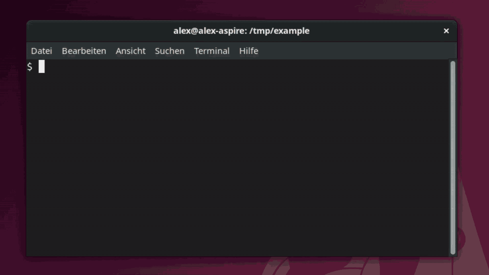
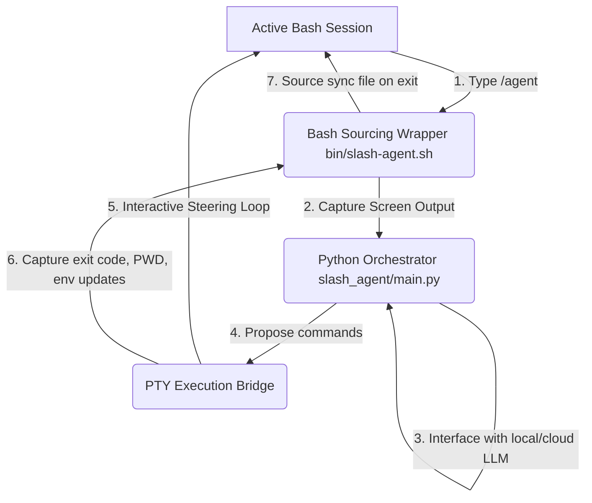

# ⚡ slash-agent: Native LLM Copilot for Your Terminal

[](https://opensource.org/licenses/MIT)
[](https://www.python.org/)
[](https://www.gnu.org/software/bash/)
[](http://makeapullrequest.com)



**slash-agent** is an ultra-lightweight, zero-overhead AI coding partner that integrates natively into your active Bash shell. It is designed to act as a seamless extension of your command line, keeping you focused in your terminal with **100% local, private LLM support** (via Ollama) or cloud powerhouses (OpenAI/Azure OpenAI).

> [!IMPORTANT]
> **A Natural Coding Partner in Your Shell—Zero Workflow Interruption.**
> slash-agent operates directly inside your active Bash session. It stays completely out of your way and consumes **zero background resources** (no running daemons, no background processes) when not in use. Simply type `/agent` when you hit a blocker: it instantly grabs your recent terminal context (tmux pane scrollback or command history) to diagnose errors, edit files, and execute commands—automatically syncing directory changes (`cd`) and environment exports back to your parent shell session when it exits.

---

## ⚡ Quick Start (5-Second Install)

Get up and running instantly. Run the quick installer script in your shell (supports Bash, Zsh, Ksh, and Fish):

```bash
curl -fsSL https://raw.githubusercontent.com/akatzmann/slash-agent/master/bin/installer.sh | bash
```

*(This automatically clones the repo to `~/.slash-agent`, configures a Python virtual environment, installs requirements, and registers the shell integration in your appropriate shell profile file, e.g. `~/.zshrc`, `~/.bashrc`, `~/.bash_profile`, or `config.fish`.)*

---


## 🌟 Key Features

* **🤖 LLM Agnostic & Privacy First:** Supports local offline models (like Ollama) with zero keys required and zero data leaving your machine, as well as OpenAI and Azure OpenAI.

* **🔌 Zero-Overhead Integration:** Completely passive. Consumes zero CPU/memory until you run `/agent`—no running background daemons, cron jobs, or log listeners.
* **🔍 Context-Aware Diagnoses:** Instantly extracts the last 50 lines of your active `tmux` pane or terminal history, letting the LLM read error outputs and tracebacks without manual copy-pasting.
* **⚡ State Synchronization:** Working directory transitions (`cd`) and environment exports (`export KEY=VAL`) made by the agent automatically sync back to your parent shell session on exit.
* **🌉 Interactive PTY Bridge:** Executes proposed commands in a pseudo-terminal (PTY), allowing you to interactively type passwords (e.g. `sudo`), view colored output, and see progress bars.
* **🕹️ Steerable Confirmation Loop:** Full control over every action:
  * **`y` (yes):** Run the command.
  * **`n` (no):** Refuse the command and inform the agent.
  * **`e` (edit):** Inline edit the command before running it.
  * **`c` (comment):** Type natural language guidance back to the agent (e.g. *"Use yarn instead of npm"*).
* **🛡️ Dry-run & Auto-confirm Modes:** Preview agent actions safely with `-n` / `--dry-run`, or run fully unattended with `-y` / `--yes`.

---

## 🎬 See it in Action

```
$ npm run build
❌ ERROR: Build failed. Cannot find module 'dotenv' in server.js:12

$ /agent Fix this
[Agent Shell] Initializing with model 'gemma4:e4b-it-qat' at 'http://127.0.0.1:11434'...
[Agent Started Task]
Analyzing terminal context... Identified missing dependency 'dotenv' in server.js.

[Agent] Proposed Command:
  $ npm install dotenv && npm run build

Confirm action: [y]es / [n]o / [e]dit / [c]omment ? y
[Agent Running]: npm install dotenv && npm run build
...
added 1 package, and audited 120 packages in 1s
✓ Build completed successfully!

I have installed the missing 'dotenv' package and verified that the build now passes.
```

---

## 🎯 Common Use Cases

* 🛠️ **Build & Test Crashes:** When a compiler error, script traceback, or unit test fails, simply run `/agent` to let it read the error logs directly and propose a fix.
* 📦 **Dependency Resolution:** Missing package imports? The agent reads the import error, installs the package, and verifies the build.
* 💻 **Quick Scripting & Automation:** Ask the agent to generate helper scripts, configure development environments, or perform regex logs processing on the fly.
* ⚙️ **System Configuration:** Easily set up local databases, systemd services, or configuration files without looking up command flags.

---

## 🔍 How it Works

Unlike standard agents that run in isolated subshells (and cannot modify your current directory or environment), **slash-agent** uses a lightweight state synchronization protocol:



1. **Context Capture:** The shell wrapper automatically captures the active `tmux` pane buffer (or history) to give the LLM immediate context.
2. **Interactive PTY Bridge:** Commands run inside a real pseudo-terminal (PTY) so you see colored outputs, progress bars, and can interact with prompts (like typing passwords for `sudo`).
3. **Parent Shell Sync:** Directory changes (`cd`) or environment variables (`export`) are safely passed back to your main shell session via a temporary sourcing script on exit.

---

## 🔧 Manual Installation

If you prefer to set up the agent manually instead of using the Quick Start script:

1. **Clone the Repository:**
   ```bash
   git clone https://github.com/akatzmann/slash-agent.git ~/.slash-agent
   cd ~/.slash-agent
   ```
2. **Install Python Requirements:**
   ```bash
   pip install -r requirements.txt
   ```
3. **Register Shell Integration:**
   Add the appropriate sourcing statement to your shell configuration file:
   * **Bash (Linux):** `source ~/.slash-agent/bin/slash-agent.sh` in `~/.bashrc`
   * **Bash (macOS):** `source ~/.slash-agent/bin/slash-agent.sh` in `~/.bash_profile` (or `~/.profile`)
   * **Zsh:** `source ~/.slash-agent/bin/slash-agent.sh` in `~/.zshrc`
   * **Ksh:** `source ~/.slash-agent/bin/slash-agent.sh` in `~/.kshrc`
   * **Fish:** `source ~/.slash-agent/bin/slash-agent.fish` in `~/.config/fish/config.fish`

---

## 💻 Windows Support (WSL2)

**slash-agent** runs natively inside Unix-like PTY environments. Native Windows execution (under standard `CMD` or `PowerShell`) is not supported due to PTY emulation limitations.

However, the tool is **100% compatible with WSL2 (Windows Subsystem for Linux)**. Windows users can run `slash-agent` by opening any WSL2 Linux terminal (such as Ubuntu or Debian) and running the standard Quick Start installation command.

---

## ⚙️ Configuration

Configure the LLM backend, endpoint, model, and capture settings in your `.env` file or shell profile:

```bash
# LLM Backend: openai (default), ollama, azure_openai, dummy
export AGENT_BACKEND="openai"

# Model name (Defaults: gpt-5.4-nano for openai, gemma4:latest for ollama)
export AGENT_MODEL="gpt-5.4-nano"

# API endpoint base URL (defaults to official OpenAI API endpoint)
export AGENT_ENDPOINT=""

# OpenAI API Key (required for default OpenAI backend)
export OPENAI_API_KEY="your-api-key-here"

# Context extraction settings
export AGENT_TMUX_LINES=50          # Lines captured from active tmux scrollback
export AGENT_HISTORY_COMMANDS=20    # Commands captured from history fallback

# Thinking / reasoning mode settings
export AGENT_THINKING_LEVEL="off"   # Thinking level: off (default), low, medium, high (for reasoning models)
```

For a full list of configuration variables (e.g., Azure OpenAI variables), see the [.env.template](.env.template) file.

### 🔄 Re-configuration

Instead of manually editing the `.env` file, you can re-run the interactive configuration prompts at any time:
```bash
/agent --configure
# or using the shortcut
/agent -c
```
This launches the setup wizard, pre-populated with your current configuration choices as defaults so you can quickly update backends, models, endpoints, keys, and thinking levels.

---

## 🛠️ Usage Examples

### 1. General Command Execution
```bash
/agent create a new directory named 'sandbox' and write a basic python flask server inside it
```

### 2. Post-Crash Diagnosis
If a compiler, build tool, or script crashes, run `/agent` with no arguments (or a request to fix it):
```bash
/agent Fix this crash
```

### 3. Dry-run Mode
Simulate proposed steps and check the agent's plan without making actual system changes:
```bash
/agent -n setup a docker compose file for PostgreSQL and Redis
```

### 4. Auto-confirm Mode
Run tasks without any confirmation prompts for safe, low, or moderate risk commands:
```bash
/agent -y update package lists and install tree
```

### 5. Auto-confirm Critical Commands
By default, critical commands (like `rm -rf` or commands using `sudo`) are not auto-confirmed by `-y` to prevent accidental damage. To auto-confirm even critical commands, pass the `--unsafe-yes` flag:
```bash
/agent --unsafe-yes clean up docker volumes and system cache
```

---

## 📘 Deep Dive

For more technical details on the architecture, the interactive PTY bridge loop, and the environment state-synchronization protocol, read the [Technical Documentation](docs/documentation.md).
